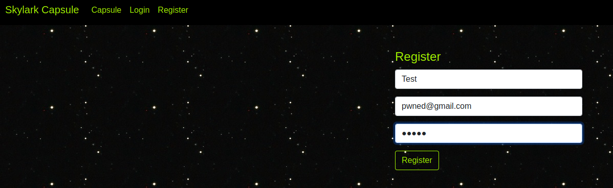

# Skylark Capsule - Tokenz

## Introduction


"Get your capsule now. Can you gain access to the capsule of 'admin' ?" That's the goal of this challenge. So let's get on board !


We quickly understand that we have to create an account to see what's happend when we are connected, to look at our capsule's specs. 
So we go on the register page and create and fake account like : id -> Test email -> pwned@gmail.com password -> 12345



Came back on the website starting page, we see that now we can get our capsule's specs. 

## Web traffic analysis


Let's start Burp suit to catch out which informations go trough the network.


So redirecting the query to the Brup's proxy, we find out something quite interesting ! 
The label "Authorization" contain something that look exactly like a JSON Web Token (Like the title of this challenge, what a surprise)
Ok so now we got the JWT of our account, let's decode it to understand a little bit more what's going on. 
I went on : https://jwt.io/, which is a pretty good tool to analyse and modify a JWT Token 


## Create a fake admin token

The token contain an id and an username, so we are going to test if we put id = 1 and username = admin, to see what's going on.
Ok we already did a good job, but unfortunatly, the JWT got a signature... That's a bad news because we got to find out this signature.
The signature is used to know if the token has been created by the website.
We are going to use John The Ripper, a great cracking tool available on Kali linux, which integrate a functionality to hack JWT signature.
So let's use it !

## Help us John !

Ok, after putting the JWT in jwt.txt, I use this command on Kali terminal : john jwt.txt --worlist=/usr/share/wordlists/rockyou.txt --format=HMAC-SHA256
And that's the result in less than 1 second :


The signature was ... skylark140584 ... Skylark like the challenge's tittle. The creator of this challenge like making jokes, anyway. 
So now, we got the signature, let's create our fake admin JWT.

## I'm the admin, am I not ?

Let's get back on jwt.io and replace id and username label without forget to enter the signature :


And now, we return on Burp suite, send the query to the repeater, modify the token with the one we just created, and forward it ! 
Finaly we did it ! Here's the flag !


```
CTF{break1ng_dem_jwtz}
```

*First writeup, I hope it was clear and understandable*


